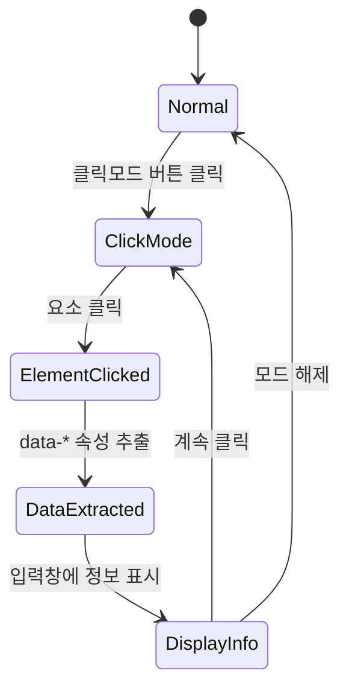
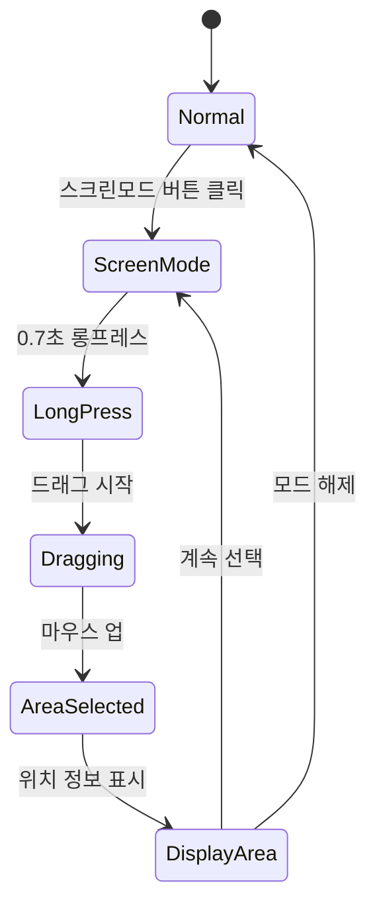
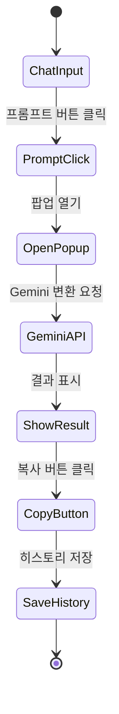
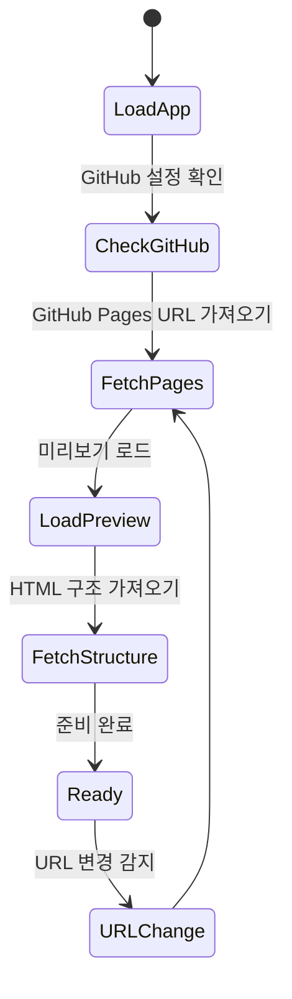

# Page Specifications
# 스윔 개발자 (Swim Developer Assistant)

버전: 1.0  
최종 수정: 2025-10-30  
담당: UI/UX Team

---

## 목차

1. [메인 레이아웃](#1-메인-레이아웃)
2. [미리보기 패널](#2-미리보기-패널)
3. [입력창 패널](#3-입력창-패널)
4. [히스토리 패널](#4-히스토리-패널)
5. [설정 모달](#5-설정-모달)
6. [프롬프트 팝업](#6-프롬프트-팝업)
7. [인터랙션 플로우](#7-인터랙션-플로우)
8. [에러 처리](#8-에러-처리)
9. [로딩 상태](#9-로딩-상태)
10. [알림 시스템](#10-알림-시스템)

---

## 1. 메인 레이아웃

### 1.1 전체 구조

```
┌─────────────────────────────────────────────────────────────┐
│  Top Navigation Bar (60px)                                  │
├──────────────────────┬───┬──────────────────────────────────┤
│                      │   │                                  │
│                      │ R │                                  │
│   Preview Panel      │ e │   Input Panel                    │
│   (60% 기본)         │ s │   (40% 기본)                      │
│                      │ i │                                  │
│                      │ z │                                  │
│                      │ e │                                  │
│                      │   │                                  │
│                      │ H │                                  │
│                      │ a │                                  │
│                      │ n │                                  │
│                      │ d │                                  │
│                      │ l │                                  │
│                      │ e │                                  │
│                      │   │                                  │
│                      │ 4 │                                  │
│                      │ p │                                  │
│                      │ x │                                  │
│                      │   │                                  │
└──────────────────────┴───┴──────────────────────────────────┘
                                            ┌──────────────────┐
                                            │ History Panel    │
                                            │ (300px, 슬라이드)│
                                            │                  │
                                            └──────────────────┘
```

### 1.2 HTML 구조

```html
<!DOCTYPE html>
<html lang="ko" data-theme="light" data-font-size="small">
<head>
  <meta charset="UTF-8">
  <meta name="viewport" content="width=device-width, initial-scale=1.0">
  <title>Swim Developer Assistant</title>
  <link rel="stylesheet" href="styles.css">
</head>
<body>
  <!-- Top Navigation -->
  <nav class="top-nav">
    <div class="top-nav__left">
      <h1 class="top-nav__logo">Swim Developer</h1>
      <div class="top-nav__url-display">
        <span id="current-url">-</span>
      </div>
    </div>
    
    <div class="top-nav__center">
      <button class="btn-click-mode" id="btnClickMode" aria-label="클릭모드">
        <span class="icon">👆</span>
        <span>클릭모드</span>
      </button>
      <button class="btn-screen-mode" id="btnScreenMode" aria-label="스크린모드">
        <span class="icon">📐</span>
        <span>스크린모드</span>
      </button>
      <button class="btn-refresh" id="btnRefresh" aria-label="새로고침">
        <span class="icon">🔄</span>
      </button>
    </div>
    
    <div class="top-nav__right">
      <button class="btn-prompt" id="btnPrompt" aria-label="프롬프트">
        <span class="icon">✨</span>
      </button>
      <button class="btn-ghost" id="btnHistory" aria-label="히스토리">
        <span class="icon">🕒</span>
      </button>
      <button class="btn-ghost" id="btnSettings" aria-label="설정">
        <span class="icon">⚙️</span>
      </button>
    </div>
  </nav>

  <!-- Main Layout -->
  <div class="layout-main">
    <!-- Preview Panel -->
    <div class="layout-main__preview" id="previewPanel">
      <div class="panel-preview">
        <iframe id="previewFrame" src="about:blank"></iframe>
        <div class="selection-box" id="selectionBox" style="display: none;"></div>
      </div>
    </div>

    <!-- Resize Handle -->
    <div class="resize-handle" id="resizeHandle"></div>

    <!-- Input Panel -->
    <div class="layout-main__input" id="inputPanel">
      <div class="panel-input">
        <div class="panel-input__chat" id="chatArea">
          <!-- Chat messages -->
        </div>
        <div class="panel-input__form">
          <textarea 
            class="textarea" 
            id="messageInput" 
            placeholder="요구사항을 입력하세요..."
            rows="3"
          ></textarea>
          <div class="panel-input__actions">
            <button class="btn-secondary" id="btnClear">지우기</button>
            <button class="btn-primary" id="btnSend">전송</button>
          </div>
        </div>
      </div>
    </div>
  </div>

  <!-- History Panel (Slide-in) -->
  <aside class="panel-history" id="historyPanel">
    <div class="panel-history__header">
      <h2>히스토리</h2>
      <button class="btn-ghost btn-sm" id="btnCloseHistory">✕</button>
    </div>
    <div class="panel-history__filters">
      <button class="filter-btn active" data-category="all">전체</button>
      <button class="filter-btn" data-category="ui">UI</button>
      <button class="filter-btn" data-category="function">기능</button>
      <button class="filter-btn" data-category="style">스타일</button>
      <button class="filter-btn" data-category="bug">버그</button>
      <button class="filter-btn" data-category="other">기타</button>
    </div>
    <div class="panel-history__list" id="historyList">
      <!-- History items -->
    </div>
  </aside>

  <!-- Modals & Popups (rendered dynamically) -->
  <div id="modalContainer"></div>
  <div id="popupContainer"></div>

  <script src="app.js"></script>
</body>
</html>
```

### 1.3 반응형 동작

```javascript
// 최소 너비 체크
if (window.innerWidth < 1280) {
  showWarning('화면 크기가 너무 작습니다. 최소 1280px 이상 필요합니다.');
}

// 리사이즈 핸들 드래그
let isResizing = false;
let startX = 0;
let startWidth = 0;

resizeHandle.addEventListener('mousedown', (e) => {
  isResizing = true;
  startX = e.clientX;
  startWidth = previewPanel.offsetWidth;
  document.body.style.cursor = 'col-resize';
});

document.addEventListener('mousemove', (e) => {
  if (!isResizing) return;
  
  const deltaX = e.clientX - startX;
  const newWidth = startWidth + deltaX;
  const totalWidth = window.innerWidth;
  const percentage = (newWidth / totalWidth) * 100;
  
  // 최소/최대 제한
  if (percentage >= 40 && percentage <= 75) {
    previewPanel.style.width = percentage + '%';
    inputPanel.style.width = (100 - percentage) + '%';
  }
});

document.addEventListener('mouseup', () => {
  if (isResizing) {
    isResizing = false;
    document.body.style.cursor = 'default';
  }
});
```

---

## 2. 미리보기 패널

### 2.1 구조 및 기능

**목적**: GitHub Pages URL을 iframe으로 로드하여 실시간 미리보기 제공

**주요 기능**:
- GitHub Pages URL 자동 로드
- 클릭모드: 요소 클릭 → data-* 속성 추출
- 스크린모드: 0.7초 롱프레스 → 영역 선택
- 새로고침 버튼
- URL 변경 감지

### 2.2 상세 명세

#### 컴포넌트 목록
```
- Top Navigation Bar (상단 고정)
  - Logo & Title
  - Current URL Display (현재 접속 URL)
  - Mode Buttons (클릭/스크린)
  - Refresh Button
  
- Preview Frame (iframe)
  - 100% 너비/높이
  - 크로스 오리진 제한 없음 (같은 도메인)
  - 자동 스크롤 동기화
  
- Selection Box (스크린모드 시)
  - 점선 테두리 (보라색)
  - 반투명 배경
  - 실시간 크기 표시
```

#### 상태 관리

```javascript
const previewState = {
  currentUrl: '',
  mode: 'normal', // 'normal' | 'click' | 'screen'
  isLoading: false,
  selectedElement: null,
  selectionArea: null
};

// URL 로드
function loadPreview(url) {
  previewState.isLoading = true;
  showLoadingOverlay();
  
  const iframe = document.getElementById('previewFrame');
  iframe.src = url;
  
  iframe.onload = () => {
    previewState.currentUrl = url;
    previewState.isLoading = false;
    hideLoadingOverlay();
    updateUrlDisplay(url);
    
    // GitHub 데이터 가져오기
    if (isGitHubConnected()) {
      fetchPageStructure();
    }
  };
  
  iframe.onerror = () => {
    previewState.isLoading = false;
    hideLoadingOverlay();
    showError('페이지 로드 실패');
  };
}
```

#### 클릭모드 구현

```javascript
function enableClickMode() {
  previewState.mode = 'click';
  
  const iframe = document.getElementById('previewFrame');
  const iframeDoc = iframe.contentDocument || iframe.contentWindow.document;
  
  // 모든 요소에 클릭 이벤트 추가
  iframeDoc.body.addEventListener('click', handleElementClick, true);
  
  // 시각적 피드백
  iframeDoc.body.style.cursor = 'crosshair';
  
  // 버튼 상태 변경
  document.getElementById('btnClickMode').classList.add('active');
}

function handleElementClick(event) {
  event.preventDefault();
  event.stopPropagation();
  
  const element = event.target;
  
  // data-* 속성 추출
  const elementInfo = {
    tag: element.tagName.toLowerCase(),
    id: element.id || null,
    classes: Array.from(element.classList),
    dataAttributes: extractDataAttributes(element),
    textContent: element.textContent.trim().substring(0, 50),
    position: getElementPosition(element)
  };
  
  // 입력창에 정보 표시
  displayElementInfo(elementInfo);
  
  // 시각적 하이라이트
  highlightElement(element);
}

function extractDataAttributes(element) {
  const dataAttrs = {};
  for (let attr of element.attributes) {
    if (attr.name.startsWith('data-')) {
      dataAttrs[attr.name] = attr.value;
    }
  }
  return dataAttrs;
}

function getElementPosition(element) {
  const rect = element.getBoundingClientRect();
  return {
    x: Math.round(rect.left),
    y: Math.round(rect.top),
    width: Math.round(rect.width),
    height: Math.round(rect.height)
  };
}
```

#### 스크린모드 구현

```javascript
function enableScreenMode() {
  previewState.mode = 'screen';
  
  const iframe = document.getElementById('previewFrame');
  const iframeDoc = iframe.contentDocument || iframe.contentWindow.document;
  
  let longPressTimer = null;
  let startX, startY;
  let isSelecting = false;
  
  // 롱프레스 시작
  iframeDoc.addEventListener('mousedown', (e) => {
    startX = e.clientX;
    startY = e.clientY;
    
    longPressTimer = setTimeout(() => {
      isSelecting = true;
      showSelectionBox(startX, startY, 0, 0);
    }, 700); // 0.7초
  });
  
  // 드래그 중
  iframeDoc.addEventListener('mousemove', (e) => {
    if (!isSelecting) return;
    
    const currentX = e.clientX;
    const currentY = e.clientY;
    
    const x = Math.min(startX, currentX);
    const y = Math.min(startY, currentY);
    const width = Math.abs(currentX - startX);
    const height = Math.abs(currentY - startY);
    
    updateSelectionBox(x, y, width, height);
  });
  
  // 선택 완료
  iframeDoc.addEventListener('mouseup', (e) => {
    clearTimeout(longPressTimer);
    
    if (isSelecting) {
      const selectionBox = document.getElementById('selectionBox');
      const rect = selectionBox.getBoundingClientRect();
      
      const areaInfo = {
        x: Math.round(rect.left),
        y: Math.round(rect.top),
        width: Math.round(rect.width),
        height: Math.round(rect.height)
      };
      
      // 입력창에 영역 정보 표시
      displayAreaInfo(areaInfo);
      
      hideSelectionBox();
      isSelecting = false;
    }
  });
  
  // 버튼 상태 변경
  document.getElementById('btnScreenMode').classList.add('active');
}

function showSelectionBox(x, y, width, height) {
  const selectionBox = document.getElementById('selectionBox');
  selectionBox.style.display = 'block';
  selectionBox.style.left = x + 'px';
  selectionBox.style.top = y + 'px';
  selectionBox.style.width = width + 'px';
  selectionBox.style.height = height + 'px';
}

function updateSelectionBox(x, y, width, height) {
  const selectionBox = document.getElementById('selectionBox');
  selectionBox.style.left = x + 'px';
  selectionBox.style.top = y + 'px';
  selectionBox.style.width = width + 'px';
  selectionBox.style.height = height + 'px';
}
```

#### 새로고침 동작

```javascript
function refreshPreview() {
  const iframe = document.getElementById('previewFrame');
  
  // 회전 애니메이션
  const refreshBtn = document.getElementById('btnRefresh');
  refreshBtn.classList.add('rotating');
  
  iframe.contentWindow.location.reload();
  
  setTimeout(() => {
    refreshBtn.classList.remove('rotating');
  }, 500);
}
```

### 2.3 데이터 바인딩

```javascript
// GitHub Pages URL 가져오기
async function fetchGitHubPagesUrl() {
  const config = getConfig();
  if (!config.githubToken || !config.githubRepo) {
    return null;
  }
  
  try {
    const [owner, repo] = config.githubRepo.split('/');
    const response = await fetch(
      `https://api.github.com/repos/${owner}/${repo}/pages`,
      {
        headers: {
          'Authorization': `Bearer ${config.githubToken}`,
          'Accept': 'application/vnd.github.v3+json'
        }
      }
    );
    
    if (response.ok) {
      const data = await response.json();
      return data.html_url;
    }
  } catch (error) {
    console.error('GitHub Pages URL 가져오기 실패:', error);
  }
  
  return null;
}

// 페이지 구조 가져오기
async function fetchPageStructure() {
  const config = getConfig();
  const [owner, repo] = config.githubRepo.split('/');
  
  try {
    // index.html 파일 가져오기
    const response = await fetch(
      `https://api.github.com/repos/${owner}/${repo}/contents/index.html`,
      {
        headers: {
          'Authorization': `Bearer ${config.githubToken}`,
          'Accept': 'application/vnd.github.v3+json'
        }
      }
    );
    
    if (response.ok) {
      const data = await response.json();
      const htmlContent = atob(data.content);
      
      // HTML 파싱 및 data-* 속성 추출
      const parser = new DOMParser();
      const doc = parser.parseFromString(htmlContent, 'text/html');
      const elementsWithData = doc.querySelectorAll('[data-component]');
      
      return Array.from(elementsWithData).map(el => ({
        component: el.dataset.component,
        id: el.id,
        classes: Array.from(el.classList)
      }));
    }
  } catch (error) {
    console.error('페이지 구조 가져오기 실패:', error);
  }
  
  return [];
}
```

### 2.4 에러 처리

```javascript
// iframe 로드 실패
iframe.onerror = () => {
  showError('페이지를 불러올 수 없습니다. URL을 확인해주세요.');
};

// 크로스 오리진 에러
try {
  iframe.contentDocument;
} catch (e) {
  showError('보안 정책으로 인해 접근할 수 없습니다. GitHub Pages URL을 사용해주세요.');
}

// GitHub API 에러
catch (error) {
  if (error.status === 404) {
    showError('Repository를 찾을 수 없습니다.');
  } else if (error.status === 401) {
    showError('GitHub 토큰이 유효하지 않습니다.');
  } else {
    showError('GitHub 연동 중 오류가 발생했습니다.');
  }
}
```

---

## 3. 입력창 패널

### 3.1 구조 및 기능

**목적**: AI와 대화하며 요구사항 작성 및 관리

**주요 기능**:
- 채팅 인터페이스
- 요소/영역 정보 자동 입력
- 복사 버튼
- Gemini 변환 (프롬프트 사용 시)
- 메시지 히스토리

### 3.2 상세 명세

#### 컴포넌트 목록

```
- Chat Area (스크롤 영역)
  - System Message (시스템 안내)
  - User Message (사용자 입력)
  - Assistant Message (AI 응답)
  - Element Info Message (클릭모드 정보)
  - Area Info Message (스크린모드 정보)
  
- Input Form (하단 고정)
  - Textarea (자동 높이 조절)
  - Clear Button
  - Send Button
```

#### 메시지 타입

```javascript
const MessageType = {
  SYSTEM: 'system',
  USER: 'user',
  ASSISTANT: 'assistant',
  ELEMENT_INFO: 'element-info',
  AREA_INFO: 'area-info'
};

function createMessage(type, content) {
  return {
    id: generateId(),
    type: type,
    content: content,
    timestamp: new Date().toISOString()
  };
}
```

#### 채팅 메시지 렌더링

```javascript
function renderMessage(message) {
  const chatArea = document.getElementById('chatArea');
  
  const messageEl = document.createElement('div');
  messageEl.className = `chat-message chat-message--${message.type}`;
  messageEl.dataset.messageId = message.id;
  
  switch (message.type) {
    case MessageType.SYSTEM:
      messageEl.innerHTML = `
        <div class="chat-message__content">
          <div class="chat-message__text">${message.content}</div>
        </div>
      `;
      break;
      
    case MessageType.USER:
      messageEl.innerHTML = `
        <div class="chat-message__avatar">U</div>
        <div class="chat-message__content">
          <div class="chat-message__header">
            <span class="chat-message__name">사용자</span>
            <span class="chat-message__time">${formatTime(message.timestamp)}</span>
          </div>
          <div class="chat-message__text">${escapeHtml(message.content)}</div>
        </div>
      `;
      break;
      
    case MessageType.ELEMENT_INFO:
      messageEl.innerHTML = `
        <div class="chat-message__avatar">🎯</div>
        <div class="chat-message__content">
          <div class="chat-message__header">
            <span class="chat-message__name">요소 정보</span>
            <span class="chat-message__time">${formatTime(message.timestamp)}</span>
            <button class="btn-copy btn-sm" data-copy-target="${message.id}">복사</button>
          </div>
          <div class="chat-message__info">
            ${renderElementInfo(message.content)}
          </div>
        </div>
      `;
      break;
      
    case MessageType.AREA_INFO:
      messageEl.innerHTML = `
        <div class="chat-message__avatar">📐</div>
        <div class="chat-message__content">
          <div class="chat-message__header">
            <span class="chat-message__name">영역 정보</span>
            <span class="chat-message__time">${formatTime(message.timestamp)}</span>
            <button class="btn-copy btn-sm" data-copy-target="${message.id}">복사</button>
          </div>
          <div class="chat-message__info">
            ${renderAreaInfo(message.content)}
          </div>
        </div>
      `;
      break;
  }
  
  chatArea.appendChild(messageEl);
  scrollToBottom(chatArea);
  
  return messageEl;
}

function renderElementInfo(info) {
  return `
    <div class="element-info">
      <div class="element-info__row">
        <span class="element-info__label">태그:</span>
        <code>${info.tag}</code>
      </div>
      ${info.id ? `
        <div class="element-info__row">
          <span class="element-info__label">ID:</span>
          <code>#${info.id}</code>
        </div>
      ` : ''}
      ${info.classes.length > 0 ? `
        <div class="element-info__row">
          <span class="element-info__label">클래스:</span>
          <code>${info.classes.map(c => '.' + c).join(' ')}</code>
        </div>
      ` : ''}
      ${Object.keys(info.dataAttributes).length > 0 ? `
        <div class="element-info__row">
          <span class="element-info__label">데이터 속성:</span>
          <pre>${JSON.stringify(info.dataAttributes, null, 2)}</pre>
        </div>
      ` : ''}
      <div class="element-info__row">
        <span class="element-info__label">위치:</span>
        <code>x: ${info.position.x}px, y: ${info.position.y}px</code>
      </div>
      <div class="element-info__row">
        <span class="element-info__label">크기:</span>
        <code>${info.position.width}px × ${info.position.height}px</code>
      </div>
      ${info.textContent ? `
        <div class="element-info__row">
          <span class="element-info__label">텍스트:</span>
          <span>"${info.textContent}"</span>
        </div>
      ` : ''}
    </div>
  `;
}

function renderAreaInfo(info) {
  return `
    <div class="area-info">
      <div class="area-info__row">
        <span class="area-info__label">시작 위치:</span>
        <code>x: ${info.x}px, y: ${info.y}px</code>
      </div>
      <div class="area-info__row">
        <span class="area-info__label">크기:</span>
        <code>${info.width}px × ${info.height}px</code>
      </div>
      <div class="area-info__preview">
        <canvas id="area-preview-${info.id}" width="${info.width}" height="${info.height}"></canvas>
      </div>
    </div>
  `;
}
```

#### 복사 버튼 동작

```javascript
function initCopyButtons() {
  document.addEventListener('click', (e) => {
    if (e.target.classList.contains('btn-copy')) {
      const messageId = e.target.dataset.copyTarget;
      const message = findMessageById(messageId);
      
      if (message) {
        copyToClipboard(formatMessageForCopy(message));
        
        // 버튼 상태 변경
        e.target.textContent = '복사됨!';
        e.target.classList.add('copied');
        
        setTimeout(() => {
          e.target.textContent = '복사';
          e.target.classList.remove('copied');
        }, 2000);
      }
    }
  });
}

function formatMessageForCopy(message) {
  switch (message.type) {
    case MessageType.ELEMENT_INFO:
      return `요소 정보:
태그: ${message.content.tag}
${message.content.id ? `ID: #${message.content.id}` : ''}
${message.content.classes.length > 0 ? `클래스: ${message.content.classes.join(' ')}` : ''}
${Object.keys(message.content.dataAttributes).length > 0 ? 
  `데이터 속성: ${JSON.stringify(message.content.dataAttributes, null, 2)}` : ''}
위치: x=${message.content.position.x}px, y=${message.content.position.y}px
크기: ${message.content.position.width}px × ${message.content.position.height}px`;
      
    case MessageType.AREA_INFO:
      return `영역 정보:
시작 위치: x=${message.content.x}px, y=${message.content.y}px
크기: ${message.content.width}px × ${message.content.height}px`;
      
    default:
      return message.content;
  }
}
```

#### 입력 폼 동작

```javascript
function initInputForm() {
  const messageInput = document.getElementById('messageInput');
  const btnSend = document.getElementById('btnSend');
  const btnClear = document.getElementById('btnClear');
  
  // 자동 높이 조절
  messageInput.addEventListener('input', () => {
    messageInput.style.height = 'auto';
    messageInput.style.height = messageInput.scrollHeight + 'px';
  });
  
  // 전송
  btnSend.addEventListener('click', () => {
    sendMessage();
  });
  
  // Enter 키 (Shift+Enter는 줄바꿈)
  messageInput.addEventListener('keydown', (e) => {
    if (e.key === 'Enter' && !e.shiftKey) {
      e.preventDefault();
      sendMessage();
    }
  });
  
  // 지우기
  btnClear.addEventListener('click', () => {
    if (confirm('입력 내용을 지우시겠습니까?')) {
      messageInput.value = '';
      messageInput.style.height = 'auto';
      messageInput.focus();
    }
  });
}

function sendMessage() {
  const messageInput = document.getElementById('messageInput');
  const content = messageInput.value.trim();
  
  if (!content) {
    return;
  }
  
  // 사용자 메시지 추가
  const message = createMessage(MessageType.USER, content);
  renderMessage(message);
  saveChatMessage(message);
  
  // 입력창 초기화
  messageInput.value = '';
  messageInput.style.height = 'auto';
  messageInput.focus();
  
  // AI 응답 (추후 구현)
  // sendToGemini(content);
}
```

### 3.3 데이터 바인딩

```javascript
// Local Storage에서 채팅 기록 불러오기
function loadChatHistory() {
  const history = localStorage.getItem('swim_chat_history');
  if (history) {
    const messages = JSON.parse(history);
    messages.forEach(msg => renderMessage(msg));
  }
}

// 채팅 메시지 저장
function saveChatMessage(message) {
  const history = localStorage.getItem('swim_chat_history');
  const messages = history ? JSON.parse(history) : [];
  
  messages.push(message);
  
  // 최대 100개까지만 저장
  if (messages.length > 100) {
    messages.shift();
  }
  
  localStorage.setItem('swim_chat_history', JSON.stringify(messages));
}

// 채팅 기록 초기화
function clearChatHistory() {
  if (confirm('모든 채팅 기록을 삭제하시겠습니까?')) {
    localStorage.removeItem('swim_chat_history');
    document.getElementById('chatArea').innerHTML = '';
    showSystemMessage('채팅 기록이 삭제되었습니다.');
  }
}
```

### 3.4 에러 처리

```javascript
// 메시지 전송 실패
try {
  sendMessage();
} catch (error) {
  showError('메시지 전송에 실패했습니다.');
  console.error(error);
}

// 복사 실패
function copyToClipboard(text) {
  try {
    navigator.clipboard.writeText(text);
    showSuccess('복사되었습니다!');
  } catch (error) {
    showError('복사에 실패했습니다.');
    console.error(error);
  }
}
```

---

## 4. 히스토리 패널

### 4.1 구조 및 기능

**목적**: 요구사항 히스토리 자동 생성 및 관리

**주요 기능**:
- 카테고리별 필터링 (UI/기능/스타일/버그/기타)
- 복사 버튼으로 히스토리 자동 생성
- 검색 기능
- 삭제 기능
- 슬라이드 인/아웃

### 4.2 상세 명세

#### 컴포넌트 목록

```
- Header
  - Title
  - Close Button
  
- Filters
  - All Button (기본 활성)
  - Category Buttons (UI, 기능, 스타일, 버그, 기타)
  
- Search Bar
  - Input Field
  - Search Icon
  
- History List (스크롤)
  - History Item
    - Category Badge
    - Timestamp
    - Text Preview (3줄 제한)
    - Actions (복사, 삭제)
```

#### HTML 구조

```html
<aside class="panel-history" id="historyPanel">
  <div class="panel-history__header">
    <h2>히스토리</h2>
    <button class="btn-ghost btn-sm" id="btnCloseHistory">
      <span class="icon">✕</span>
    </button>
  </div>
  
  <div class="panel-history__search">
    <input 
      type="text" 
      class="input-text" 
      id="historySearch" 
      placeholder="검색..."
    >
  </div>
  
  <div class="panel-history__filters">
    <button class="filter-btn active" data-category="all">
      전체 <span class="filter-btn__count">12</span>
    </button>
    <button class="filter-btn" data-category="ui">
      UI <span class="filter-btn__count">5</span>
    </button>
    <button class="filter-btn" data-category="function">
      기능 <span class="filter-btn__count">3</span>
    </button>
    <button class="filter-btn" data-category="style">
      스타일 <span class="filter-btn__count">2</span>
    </button>
    <button class="filter-btn" data-category="bug">
      버그 <span class="filter-btn__count">1</span>
    </button>
    <button class="filter-btn" data-category="other">
      기타 <span class="filter-btn__count">1</span>
    </button>
  </div>
  
  <div class="panel-history__list" id="historyList">
    <!-- History items dynamically rendered -->
  </div>
</aside>
```

#### 히스토리 아이템 렌더링

```javascript
function renderHistoryItem(item) {
  const historyList = document.getElementById('historyList');
  
  const itemEl = document.createElement('div');
  itemEl.className = 'history-item';
  itemEl.dataset.historyId = item.id;
  itemEl.dataset.category = item.category;
  
  itemEl.innerHTML = `
    <div class="history-item__header">
      <span class="history-item__category history-item__category--${item.category}">
        ${getCategoryLabel(item.category)}
      </span>
      <span class="history-item__time">${formatRelativeTime(item.timestamp)}</span>
    </div>
    <div class="history-item__text">${escapeHtml(item.text)}</div>
    <div class="history-item__actions">
      <button class="btn-ghost btn-sm" data-action="copy" data-history-id="${item.id}">
        <span class="icon">📋</span> 복사
      </button>
      <button class="btn-ghost btn-sm" data-action="delete" data-history-id="${item.id}">
        <span class="icon">🗑️</span> 삭제
      </button>
    </div>
  `;
  
  // 클릭 시 상세 보기
  itemEl.addEventListener('click', (e) => {
    if (!e.target.closest('.history-item__actions')) {
      showHistoryDetail(item);
    }
  });
  
  historyList.appendChild(itemEl);
}

function getCategoryLabel(category) {
  const labels = {
    ui: 'UI',
    function: '기능',
    style: '스타일',
    bug: '버그',
    other: '기타'
  };
  return labels[category] || '기타';
}

function getCategoryColor(category) {
  const colors = {
    ui: '#007AFF',
    function: '#34C759',
    style: '#AF52DE',
    bug: '#FF3B30',
    other: '#6E6E73'
  };
  return colors[category] || '#6E6E73';
}
```

#### 히스토리 자동 생성

```javascript
async function generateHistory(messageContent) {
  // 복사 버튼 클릭 시 Gemini API로 전송
  const config = getConfig();
  
  if (!config.geminiApiKey) {
    showError('Gemini API 키가 설정되지 않았습니다.');
    return;
  }
  
  showLoading('히스토리 생성 중...');
  
  try {
    const response = await fetch(
      `https://generativelanguage.googleapis.com/v1beta/models/gemini-2.0-flash-exp:generateContent?key=${config.geminiApiKey}`,
      {
        method: 'POST',
        headers: {
          'Content-Type': 'application/json'
        },
        body: JSON.stringify({
          contents: [{
            parts: [{
              text: `다음 요구사항을 분석하여 카테고리를 판단하고 간단히 요약해주세요.

카테고리:
- ui: UI/레이아웃 변경
- function: 기능 추가/수정
- style: 스타일/디자인 변경
- bug: 버그 수정
- other: 기타

요구사항:
${messageContent}

응답 형식 (JSON):
{
  "category": "카테고리",
  "summary": "요약 (50자 이내)"
}`
            }]
          }]
        })
      }
    );
    
    if (!response.ok) {
      throw new Error('Gemini API 요청 실패');
    }
    
    const data = await response.json();
    const result = JSON.parse(
      data.candidates[0].content.parts[0].text
    );
    
    // 히스토리 저장
    const historyItem = {
      id: generateId(),
      category: result.category,
      text: messageContent,
      summary: result.summary,
      timestamp: new Date().toISOString()
    };
    
    saveHistory(historyItem);
    renderHistoryItem(historyItem);
    updateFilterCounts();
    
    hideLoading();
    showSuccess('히스토리에 저장되었습니다!');
    
  } catch (error) {
    hideLoading();
    showError('히스토리 생성에 실패했습니다.');
    console.error(error);
  }
}
```

#### 필터링 및 검색

```javascript
function initHistoryFilters() {
  const filterButtons = document.querySelectorAll('.filter-btn');
  const searchInput = document.getElementById('historySearch');
  
  // 카테고리 필터
  filterButtons.forEach(btn => {
    btn.addEventListener('click', () => {
      // 활성 상태 변경
      filterButtons.forEach(b => b.classList.remove('active'));
      btn.classList.add('active');
      
      const category = btn.dataset.category;
      filterHistory(category, searchInput.value);
    });
  });
  
  // 검색
  let searchTimeout;
  searchInput.addEventListener('input', (e) => {
    clearTimeout(searchTimeout);
    searchTimeout = setTimeout(() => {
      const activeCategory = document.querySelector('.filter-btn.active').dataset.category;
      filterHistory(activeCategory, e.target.value);
    }, 300);
  });
}

function filterHistory(category, searchText) {
  const historyItems = document.querySelectorAll('.history-item');
  
  historyItems.forEach(item => {
    const itemCategory = item.dataset.category;
    const itemText = item.querySelector('.history-item__text').textContent.toLowerCase();
    
    const categoryMatch = category === 'all' || itemCategory === category;
    const searchMatch = !searchText || itemText.includes(searchText.toLowerCase());
    
    if (categoryMatch && searchMatch) {
      item.style.display = 'block';
    } else {
      item.style.display = 'none';
    }
  });
}

function updateFilterCounts() {
  const history = loadHistory();
  const counts = {
    all: history.length,
    ui: 0,
    function: 0,
    style: 0,
    bug: 0,
    other: 0
  };
  
  history.forEach(item => {
    counts[item.category]++;
  });
  
  Object.keys(counts).forEach(category => {
    const btn = document.querySelector(`.filter-btn[data-category="${category}"]`);
    if (btn) {
      const countEl = btn.querySelector('.filter-btn__count');
      if (countEl) {
        countEl.textContent = counts[category];
      }
    }
  });
}
```

#### 슬라이드 동작

```javascript
function toggleHistoryPanel() {
  const historyPanel = document.getElementById('historyPanel');
  historyPanel.classList.toggle('open');
}

function closeHistoryPanel() {
  const historyPanel = document.getElementById('historyPanel');
  historyPanel.classList.remove('open');
}

// 외부 클릭 시 닫기
document.addEventListener('click', (e) => {
  const historyPanel = document.getElementById('historyPanel');
  const btnHistory = document.getElementById('btnHistory');
  
  if (historyPanel.classList.contains('open') &&
      !historyPanel.contains(e.target) &&
      !btnHistory.contains(e.target)) {
    closeHistoryPanel();
  }
});
```

### 4.3 데이터 바인딩

```javascript
// Local Storage에서 히스토리 불러오기
function loadHistory() {
  const history = localStorage.getItem('swim_history');
  return history ? JSON.parse(history) : [];
}

// 히스토리 저장
function saveHistory(item) {
  const history = loadHistory();
  history.unshift(item); // 최신순
  
  // 최대 50개까지만 저장
  if (history.length > 50) {
    history.pop();
  }
  
  localStorage.setItem('swim_history', JSON.stringify(history));
}

// 히스토리 삭제
function deleteHistory(id) {
  const history = loadHistory();
  const filtered = history.filter(item => item.id !== id);
  localStorage.setItem('swim_history', JSON.stringify(filtered));
  
  // UI에서 제거
  const itemEl = document.querySelector(`[data-history-id="${id}"]`);
  if (itemEl) {
    itemEl.remove();
  }
  
  updateFilterCounts();
}

// 히스토리 초기화 (렌더링)
function initHistoryPanel() {
  const history = loadHistory();
  history.forEach(item => renderHistoryItem(item));
  updateFilterCounts();
}
```

### 4.4 에러 처리

```javascript
// Gemini API 에러
catch (error) {
  if (error.status === 401) {
    showError('Gemini API 키가 유효하지 않습니다.');
  } else if (error.status === 429) {
    showError('API 요청 한도를 초과했습니다. 잠시 후 다시 시도해주세요.');
  } else {
    showError('히스토리 생성 중 오류가 발생했습니다.');
  }
}

// Local Storage 저장 실패
try {
  localStorage.setItem('swim_history', JSON.stringify(history));
} catch (e) {
  if (e.name === 'QuotaExceededError') {
    showError('저장 공간이 부족합니다. 오래된 히스토리를 삭제해주세요.');
  }
}
```

---

## 5. 설정 모달

### 5.1 구조 및 기능

**목적**: 앱 설정 관리 (GitHub 연동, API 키, 테마, 폰트)

**주요 기능**:
- GitHub 연동 (Personal Access Token, Repository)
- Gemini API 키 설정
- 테마 전환 (Light/Dark)
- 폰트 크기 조절 (Small/Medium/Large)
- 설정 저장/불러오기

### 5.2 상세 명세

#### HTML 구조

```html
<div class="modal-overlay" id="settingsModal" style="display: none;">
  <div class="modal-content">
    <div class="modal-header">
      <h2 id="modal-title">설정</h2>
      <button class="modal-close" aria-label="닫기">
        <span class="icon">✕</span>
      </button>
    </div>
    
    <div class="modal-body">
      <!-- GitHub 설정 -->
      <section class="settings-section">
        <h3 class="settings-section__title">GitHub 연동</h3>
        <div class="form-group">
          <label for="githubToken">Personal Access Token</label>
          <input 
            type="password" 
            class="input-text" 
            id="githubToken" 
            placeholder="ghp_xxxxxxxxxxxxx"
          >
          <small class="form-help">
            <a href="https://github.com/settings/tokens" target="_blank">토큰 생성하기</a>
          </small>
        </div>
        <div class="form-group">
          <label for="githubRepo">Repository</label>
          <input 
            type="text" 
            class="input-text" 
            id="githubRepo" 
            placeholder="username/repository"
          >
          <small class="form-help">예: username/my-project</small>
        </div>
        <div class="form-group">
          <button class="btn-secondary" id="btnTestGitHub">연결 테스트</button>
          <span id="githubStatus" class="status-indicator"></span>
        </div>
      </section>
      
      <!-- Gemini API -->
      <section class="settings-section">
        <h3 class="settings-section__title">Gemini API</h3>
        <div class="form-group">
          <label for="geminiApiKey">API Key</label>
          <input 
            type="password" 
            class="input-text" 
            id="geminiApiKey" 
            placeholder="AIzaSyxxxxxxxxxxxxx"
          >
          <small class="form-help">
            <a href="https://aistudio.google.com/apikey" target="_blank">API 키 생성하기</a>
          </small>
        </div>
        <div class="form-group">
          <button class="btn-secondary" id="btnTestGemini">연결 테스트</button>
          <span id="geminiStatus" class="status-indicator"></span>
        </div>
      </section>
      
      <!-- 테마 -->
      <section class="settings-section">
        <h3 class="settings-section__title">테마</h3>
        <div class="form-group">
          <div class="radio-group">
            <label class="radio-label">
              <input type="radio" name="theme" value="light" checked>
              <span>라이트</span>
            </label>
            <label class="radio-label">
              <input type="radio" name="theme" value="dark">
              <span>다크</span>
            </label>
          </div>
        </div>
      </section>
      
      <!-- 폰트 크기 -->
      <section class="settings-section">
        <h3 class="settings-section__title">폰트 크기</h3>
        <div class="form-group">
          <div class="radio-group">
            <label class="radio-label">
              <input type="radio" name="fontSize" value="small" checked>
              <span>작게</span>
            </label>
            <label class="radio-label">
              <input type="radio" name="fontSize" value="medium">
              <span>보통</span>
            </label>
            <label class="radio-label">
              <input type="radio" name="fontSize" value="large">
              <span>크게</span>
            </label>
          </div>
        </div>
      </section>
      
      <!-- 데이터 관리 -->
      <section class="settings-section">
        <h3 class="settings-section__title">데이터 관리</h3>
        <div class="form-group">
          <button class="btn-secondary" id="btnExportData">내보내기</button>
          <button class="btn-secondary" id="btnImportData">가져오기</button>
          <button class="btn-danger" id="btnClearData">전체 삭제</button>
        </div>
      </section>
    </div>
    
    <div class="modal-footer">
      <button class="btn-secondary" id="btnCancelSettings">취소</button>
      <button class="btn-primary" id="btnSaveSettings">저장</button>
    </div>
  </div>
</div>
```

#### 설정 모달 열기/닫기

```javascript
function openSettingsModal() {
  const modal = document.getElementById('settingsModal');
  modal.style.display = 'flex';
  
  // 현재 설정 불러오기
  loadCurrentSettings();
  
  // 포커스
  document.getElementById('githubToken').focus();
}

function closeSettingsModal() {
  const modal = document.getElementById('settingsModal');
  modal.style.display = 'none';
}

// ESC 키로 닫기
document.addEventListener('keydown', (e) => {
  if (e.key === 'Escape') {
    const modal = document.getElementById('settingsModal');
    if (modal.style.display === 'flex') {
      closeSettingsModal();
    }
  }
});

// 외부 클릭으로 닫기
document.getElementById('settingsModal').addEventListener('click', (e) => {
  if (e.target.id === 'settingsModal') {
    closeSettingsModal();
  }
});
```

#### 설정 저장/불러오기

```javascript
function loadCurrentSettings() {
  const config = getConfig();
  
  document.getElementById('githubToken').value = config.githubToken || '';
  document.getElementById('githubRepo').value = config.githubRepo || '';
  document.getElementById('geminiApiKey').value = config.geminiApiKey || '';
  
  document.querySelector(`input[name="theme"][value="${config.theme}"]`).checked = true;
  document.querySelector(`input[name="fontSize"][value="${config.fontSize}"]`).checked = true;
}

function saveSettings() {
  const config = {
    githubToken: document.getElementById('githubToken').value.trim(),
    githubRepo: document.getElementById('githubRepo').value.trim(),
    geminiApiKey: document.getElementById('geminiApiKey').value.trim(),
    theme: document.querySelector('input[name="theme"]:checked').value,
    fontSize: document.querySelector('input[name="fontSize"]:checked').value
  };
  
  // 암호화하여 저장 (중요!)
  const encrypted = encryptConfig(config);
  localStorage.setItem('swim_config', encrypted);
  
  // 테마/폰트 적용
  applyTheme(config.theme);
  applyFontSize(config.fontSize);
  
  closeSettingsModal();
  showSuccess('설정이 저장되었습니다!');
}

function getConfig() {
  const encrypted = localStorage.getItem('swim_config');
  if (!encrypted) {
    return {
      githubToken: '',
      githubRepo: '',
      geminiApiKey: '',
      theme: 'light',
      fontSize: 'small'
    };
  }
  
  return decryptConfig(encrypted);
}

// 간단한 암호화 (실제로는 더 강력한 암호화 필요)
function encryptConfig(config) {
  return btoa(JSON.stringify(config));
}

function decryptConfig(encrypted) {
  return JSON.parse(atob(encrypted));
}
```

#### GitHub 연결 테스트

```javascript
async function testGitHubConnection() {
  const token = document.getElementById('githubToken').value.trim();
  const repo = document.getElementById('githubRepo').value.trim();
  
  if (!token || !repo) {
    showError('토큰과 Repository를 입력해주세요.');
    return;
  }
  
  const statusEl = document.getElementById('githubStatus');
  statusEl.textContent = '테스트 중...';
  statusEl.className = 'status-indicator status-indicator--loading';
  
  try {
    const [owner, repoName] = repo.split('/');
    const response = await fetch(
      `https://api.github.com/repos/${owner}/${repoName}`,
      {
        headers: {
          'Authorization': `Bearer ${token}`,
          'Accept': 'application/vnd.github.v3+json'
        }
      }
    );
    
    if (response.ok) {
      statusEl.textContent = '✓ 연결 성공';
      statusEl.className = 'status-indicator status-indicator--success';
    } else if (response.status === 404) {
      statusEl.textContent = '✗ Repository를 찾을 수 없습니다';
      statusEl.className = 'status-indicator status-indicator--error';
    } else if (response.status === 401) {
      statusEl.textContent = '✗ 토큰이 유효하지 않습니다';
      statusEl.className = 'status-indicator status-indicator--error';
    } else {
      throw new Error('연결 실패');
    }
  } catch (error) {
    statusEl.textContent = '✗ 연결 실패';
    statusEl.className = 'status-indicator status-indicator--error';
    console.error(error);
  }
}
```

#### Gemini API 연결 테스트

```javascript
async function testGeminiConnection() {
  const apiKey = document.getElementById('geminiApiKey').value.trim();
  
  if (!apiKey) {
    showError('API 키를 입력해주세요.');
    return;
  }
  
  const statusEl = document.getElementById('geminiStatus');
  statusEl.textContent = '테스트 중...';
  statusEl.className = 'status-indicator status-indicator--loading';
  
  try {
    const response = await fetch(
      `https://generativelanguage.googleapis.com/v1beta/models/gemini-2.0-flash-exp:generateContent?key=${apiKey}`,
      {
        method: 'POST',
        headers: {
          'Content-Type': 'application/json'
        },
        body: JSON.stringify({
          contents: [{
            parts: [{
              text: 'Hello'
            }]
          }]
        })
      }
    );
    
    if (response.ok) {
      statusEl.textContent = '✓ 연결 성공';
      statusEl.className = 'status-indicator status-indicator--success';
    } else if (response.status === 401 || response.status === 403) {
      statusEl.textContent = '✗ API 키가 유효하지 않습니다';
      statusEl.className = 'status-indicator status-indicator--error';
    } else {
      throw new Error('연결 실패');
    }
  } catch (error) {
    statusEl.textContent = '✗ 연결 실패';
    statusEl.className = 'status-indicator status-indicator--error';
    console.error(error);
  }
}
```

#### 테마/폰트 적용

```javascript
function applyTheme(theme) {
  document.documentElement.setAttribute('data-theme', theme);
}

function applyFontSize(fontSize) {
  document.documentElement.setAttribute('data-font-size', fontSize);
}

// 초기화
function initTheme() {
  const config = getConfig();
  applyTheme(config.theme);
  applyFontSize(config.fontSize);
}
```

#### 데이터 관리

```javascript
// 내보내기
function exportData() {
  const data = {
    config: getConfig(),
    history: loadHistory(),
    chatHistory: JSON.parse(localStorage.getItem('swim_chat_history') || '[]')
  };
  
  const blob = new Blob([JSON.stringify(data, null, 2)], { type: 'application/json' });
  const url = URL.createObjectURL(blob);
  
  const a = document.createElement('a');
  a.href = url;
  a.download = `swim-developer-backup-${Date.now()}.json`;
  a.click();
  
  URL.revokeObjectURL(url);
  showSuccess('데이터가 내보내졌습니다!');
}

// 가져오기
function importData() {
  const input = document.createElement('input');
  input.type = 'file';
  input.accept = 'application/json';
  
  input.onchange = (e) => {
    const file = e.target.files[0];
    const reader = new FileReader();
    
    reader.onload = (event) => {
      try {
        const data = JSON.parse(event.target.result);
        
        // 검증
        if (!data.config || !data.history || !data.chatHistory) {
          throw new Error('잘못된 파일 형식');
        }
        
        // 복원
        localStorage.setItem('swim_config', encryptConfig(data.config));
        localStorage.setItem('swim_history', JSON.stringify(data.history));
        localStorage.setItem('swim_chat_history', JSON.stringify(data.chatHistory));
        
        showSuccess('데이터가 복원되었습니다! 페이지를 새로고침합니다.');
        
        setTimeout(() => {
          window.location.reload();
        }, 1500);
        
      } catch (error) {
        showError('데이터 가져오기에 실패했습니다.');
        console.error(error);
      }
    };
    
    reader.readAsText(file);
  };
  
  input.click();
}

// 전체 삭제
function clearAllData() {
  if (confirm('모든 데이터를 삭제하시겠습니까? 이 작업은 되돌릴 수 없습니다.')) {
    if (confirm('정말로 삭제하시겠습니까?')) {
      localStorage.clear();
      showSuccess('모든 데이터가 삭제되었습니다! 페이지를 새로고침합니다.');
      
      setTimeout(() => {
        window.location.reload();
      }, 1500);
    }
  }
}
```

---

## 6. 프롬프트 팝업

### 6.1 구조 및 기능

**목적**: 복사 버튼 클릭 시 Gemini로 텍스트 변환

**주요 기능**:
- 텍스트 변환 (AI 개발 에이전트가 이해하기 쉽게)
- 변환 결과 미리보기
- 히스토리 자동 저장
- 복사 기능

### 6.2 상세 명세

#### HTML 구조

```html
<div class="popup-prompt" id="promptPopup" style="display: none;">
  <div class="popup-prompt__header">
    <h3>요구사항 변환</h3>
    <button class="btn-ghost btn-sm" id="btnClosePrompt">✕</button>
  </div>
  
  <div class="popup-prompt__body">
    <div class="popup-prompt__section">
      <label>원본 텍스트</label>
      <div class="popup-prompt__original" id="promptOriginal">
        <!-- 원본 텍스트 표시 -->
      </div>
    </div>
    
    <div class="popup-prompt__divider">
      <span class="icon">↓</span>
    </div>
    
    <div class="popup-prompt__section">
      <label>변환된 텍스트</label>
      <div class="popup-prompt__result" id="promptResult">
        <div class="loading-spinner"></div>
        <span>변환 중...</span>
      </div>
    </div>
  </div>
  
  <div class="popup-prompt__footer">
    <button class="btn-secondary" id="btnCancelPrompt">취소</button>
    <button class="btn-primary" id="btnCopyPrompt">복사 & 히스토리 저장</button>
  </div>
</div>
```

#### 프롬프트 팝업 열기

```javascript
function openPromptPopup(messageContent) {
  const popup = document.getElementById('promptPopup');
  const originalEl = document.getElementById('promptOriginal');
  const resultEl = document.getElementById('promptResult');
  
  // 원본 텍스트 표시
  originalEl.textContent = messageContent;
  
  // 로딩 상태
  resultEl.innerHTML = `
    <div class="loading-spinner"></div>
    <span>변환 중...</span>
  `;
  
  popup.style.display = 'block';
  
  // Gemini로 변환
  transformText(messageContent);
}

function closePromptPopup() {
  const popup = document.getElementById('promptPopup');
  popup.style.display = 'none';
}
```

#### Gemini 텍스트 변환

```javascript
async function transformText(text) {
  const config = getConfig();
  
  if (!config.geminiApiKey) {
    showError('Gemini API 키가 설정되지 않았습니다.');
    closePromptPopup();
    return;
  }
  
  try {
    const response = await fetch(
      `https://generativelanguage.googleapis.com/v1beta/models/gemini-2.0-flash-exp:generateContent?key=${config.geminiApiKey}`,
      {
        method: 'POST',
        headers: {
          'Content-Type': 'application/json'
        },
        body: JSON.stringify({
          contents: [{
            parts: [{
              text: `당신은 개발 요구사항 변환 전문가입니다. 
사용자가 입력한 요구사항을 AI 개발 에이전트가 이해하기 쉬운 형식으로 변환해주세요.

변환 규칙:
1. 명확하고 구체적인 표현 사용
2. 기술 용어 정확히 사용
3. 단계별로 구조화
4. 모호한 표현 제거
5. 예시 포함 (필요 시)

원본 요구사항:
${text}

변환된 요구사항:`
            }]
          }]
        })
      }
    );
    
    if (!response.ok) {
      throw new Error('Gemini API 요청 실패');
    }
    
    const data = await response.json();
    const transformedText = data.candidates[0].content.parts[0].text;
    
    // 결과 표시
    const resultEl = document.getElementById('promptResult');
    resultEl.innerHTML = `<pre>${escapeHtml(transformedText)}</pre>`;
    
    // 복사 버튼 활성화
    document.getElementById('btnCopyPrompt').disabled = false;
    
    // 전역 변수에 저장 (복사 시 사용)
    window.currentTransformedText = transformedText;
    
  } catch (error) {
    const resultEl = document.getElementById('promptResult');
    resultEl.innerHTML = `<span class="text-error">변환 실패: ${error.message}</span>`;
    console.error(error);
  }
}
```

#### 복사 & 히스토리 저장

```javascript
function copyAndSaveToHistory() {
  if (!window.currentTransformedText) {
    showError('변환된 텍스트가 없습니다.');
    return;
  }
  
  // 클립보드에 복사
  copyToClipboard(window.currentTransformedText);
  
  // 히스토리 자동 생성
  generateHistory(window.currentTransformedText);
  
  // 팝업 닫기
  closePromptPopup();
  
  showSuccess('복사 완료! 히스토리에 저장되었습니다.');
}
```

---

## 7. 인터랙션 플로우

### 7.1 기본 사용 흐름

```
1. 앱 시작
   ↓
2. GitHub Pages URL 자동 로드 (설정된 경우)
   ↓
3. 미리보기 패널에 페이지 표시
   ↓
4. 사용자가 모드 선택
   ├─ 클릭모드: 요소 클릭 → 정보 추출 → 입력창에 표시
   └─ 스크린모드: 롱프레스 → 영역 선택 → 위치 정보 표시
   ↓
5. 입력창에서 요구사항 작성
   ↓
6. (선택) 프롬프트 버튼 클릭 → Gemini 변환
   ↓
7. 복사 버튼 → 히스토리 자동 저장
   ↓
8. 히스토리 패널에서 관리
```

### 7.2 클릭모드 플로우



### 7.3 스크린모드 플로우



### 7.4 프롬프트 플로우



### 7.5 GitHub 동기화 플로우



---

## 8. 에러 처리

### 8.1 에러 유형

```javascript
const ErrorType = {
  NETWORK: 'network',
  API: 'api',
  VALIDATION: 'validation',
  STORAGE: 'storage',
  PERMISSION: 'permission',
  UNKNOWN: 'unknown'
};

class AppError extends Error {
  constructor(type, message, details = null) {
    super(message);
    this.type = type;
    this.details = details;
    this.timestamp = new Date().toISOString();
  }
}
```

### 8.2 전역 에러 핸들러

```javascript
function handleError(error) {
  console.error('[ERROR]', error);
  
  let userMessage = '';
  
  switch (error.type) {
    case ErrorType.NETWORK:
      userMessage = '네트워크 연결을 확인해주세요.';
      break;
    case ErrorType.API:
      userMessage = error.message;
      break;
    case ErrorType.VALIDATION:
      userMessage = error.message;
      break;
    case ErrorType.STORAGE:
      userMessage = '저장 공간이 부족합니다.';
      break;
    case ErrorType.PERMISSION:
      userMessage = '권한이 없습니다.';
      break;
    default:
      userMessage = '예기치 않은 오류가 발생했습니다.';
  }
  
  showError(userMessage);
  
  // 에러 로그 저장 (디버깅용)
  logError(error);
}

function logError(error) {
  const errorLog = {
    type: error.type,
    message: error.message,
    details: error.details,
    timestamp: error.timestamp,
    userAgent: navigator.userAgent
  };
  
  const logs = JSON.parse(localStorage.getItem('swim_error_logs') || '[]');
  logs.push(errorLog);
  
  // 최대 50개까지만 저장
  if (logs.length > 50) {
    logs.shift();
  }
  
  localStorage.setItem('swim_error_logs', JSON.stringify(logs));
}
```

### 8.3 주요 에러 시나리오

```javascript
// iframe 로드 실패
iframe.onerror = () => {
  throw new AppError(
    ErrorType.NETWORK,
    '페이지를 불러올 수 없습니다.'
  );
};

// GitHub API 실패
if (response.status === 404) {
  throw new AppError(
    ErrorType.API,
    'Repository를 찾을 수 없습니다.',
    { repo: config.githubRepo }
  );
}

// Gemini API 실패
if (response.status === 429) {
  throw new AppError(
    ErrorType.API,
    'API 요청 한도를 초과했습니다.',
    { retryAfter: response.headers.get('Retry-After') }
  );
}

// Local Storage 초과
try {
  localStorage.setItem(key, value);
} catch (e) {
  if (e.name === 'QuotaExceededError') {
    throw new AppError(
      ErrorType.STORAGE,
      '저장 공간이 부족합니다.'
    );
  }
}
```

---

## 9. 로딩 상태

### 9.1 로딩 인디케이터

```javascript
function showLoadingOverlay(message = '로딩 중...') {
  const overlay = document.createElement('div');
  overlay.className = 'loading-overlay';
  overlay.id = 'loadingOverlay';
  overlay.innerHTML = `
    <div class="loading-content">
      <div class="loading-spinner"></div>
      <p>${message}</p>
    </div>
  `;
  document.body.appendChild(overlay);
}

function hideLoadingOverlay() {
  const overlay = document.getElementById('loadingOverlay');
  if (overlay) {
    overlay.remove();
  }
}

function updateLoadingMessage(message) {
  const overlay = document.getElementById('loadingOverlay');
  if (overlay) {
    const p = overlay.querySelector('p');
    if (p) {
      p.textContent = message;
    }
  }
}
```

### 9.2 버튼 로딩 상태

```javascript
function setButtonLoading(button, isLoading) {
  if (isLoading) {
    button.disabled = true;
    button.dataset.originalText = button.textContent;
    button.innerHTML = `
      <span class="loading-spinner loading-spinner--sm"></span>
      <span>처리 중...</span>
    `;
  } else {
    button.disabled = false;
    button.textContent = button.dataset.originalText;
  }
}
```

### 9.3 스켈레톤 로딩

```javascript
function showHistorySkeleton() {
  const historyList = document.getElementById('historyList');
  historyList.innerHTML = `
    <div class="skeleton-item">
      <div class="skeleton-header"></div>
      <div class="skeleton-text"></div>
      <div class="skeleton-text"></div>
    </div>
  `.repeat(5);
}
```

---

## 10. 알림 시스템

### 10.1 토스트 알림

```javascript
function showToast(message, type = 'info', duration = 3000) {
  const toast = document.createElement('div');
  toast.className = `toast toast--${type}`;
  toast.innerHTML = `
    <span class="toast__icon">${getToastIcon(type)}</span>
    <span class="toast__message">${escapeHtml(message)}</span>
  `;
  
  document.body.appendChild(toast);
  
  // 애니메이션
  setTimeout(() => {
    toast.classList.add('toast--show');
  }, 10);
  
  // 자동 제거
  setTimeout(() => {
    toast.classList.remove('toast--show');
    setTimeout(() => {
      toast.remove();
    }, 300);
  }, duration);
}

function getToastIcon(type) {
  const icons = {
    success: '✓',
    error: '✗',
    warning: '⚠',
    info: 'ℹ'
  };
  return icons[type] || icons.info;
}

// 별칭 함수
function showSuccess(message) {
  showToast(message, 'success');
}

function showError(message) {
  showToast(message, 'error');
}

function showWarning(message) {
  showToast(message, 'warning');
}

function showInfo(message) {
  showToast(message, 'info');
}
```

### 10.2 확인 다이얼로그

```javascript
function showConfirm(message, onConfirm, onCancel = null) {
  const dialog = document.createElement('div');
  dialog.className = 'dialog-overlay';
  dialog.innerHTML = `
    <div class="dialog-content">
      <div class="dialog-body">
        <p>${escapeHtml(message)}</p>
      </div>
      <div class="dialog-footer">
        <button class="btn-secondary" data-action="cancel">취소</button>
        <button class="btn-primary" data-action="confirm">확인</button>
      </div>
    </div>
  `;
  
  document.body.appendChild(dialog);
  
  dialog.querySelector('[data-action="confirm"]').addEventListener('click', () => {
    dialog.remove();
    onConfirm();
  });
  
  dialog.querySelector('[data-action="cancel"]').addEventListener('click', () => {
    dialog.remove();
    if (onCancel) onCancel();
  });
}
```

---

## 부록: 유틸리티 함수

```javascript
// ID 생성
function generateId() {
  return `${Date.now()}-${Math.random().toString(36).substr(2, 9)}`;
}

// HTML 이스케이프
function escapeHtml(text) {
  const div = document.createElement('div');
  div.textContent = text;
  return div.innerHTML;
}

// 시간 포맷
function formatTime(timestamp) {
  const date = new Date(timestamp);
  return date.toLocaleTimeString('ko-KR', {
    hour: '2-digit',
    minute: '2-digit'
  });
}

function formatRelativeTime(timestamp) {
  const now = new Date();
  const date = new Date(timestamp);
  const diff = now - date;
  
  const minutes = Math.floor(diff / 60000);
  const hours = Math.floor(diff / 3600000);
  const days = Math.floor(diff / 86400000);
  
  if (minutes < 1) return '방금 전';
  if (minutes < 60) return `${minutes}분 전`;
  if (hours < 24) return `${hours}시간 전`;
  if (days < 7) return `${days}일 전`;
  
  return date.toLocaleDateString('ko-KR');
}

// 스크롤
function scrollToBottom(element) {
  element.scrollTop = element.scrollHeight;
}

// 클립보드
async function copyToClipboard(text) {
  try {
    await navigator.clipboard.writeText(text);
    return true;
  } catch (error) {
    console.error('복사 실패:', error);
    return false;
  }
}

// 디바운스
function debounce(func, wait) {
  let timeout;
  return function executedFunction(...args) {
    const later = () => {
      clearTimeout(timeout);
      func(...args);
    };
    clearTimeout(timeout);
    timeout = setTimeout(later, wait);
  };
}
```

---

**문서 끝**

이 페이지 명세서는 스윔 개발자 프로젝트의 모든 화면과 인터랙션을 정의합니다.  
개발 시 이 문서를 참조하여 일관된 사용자 경험을 제공해야 합니다.
